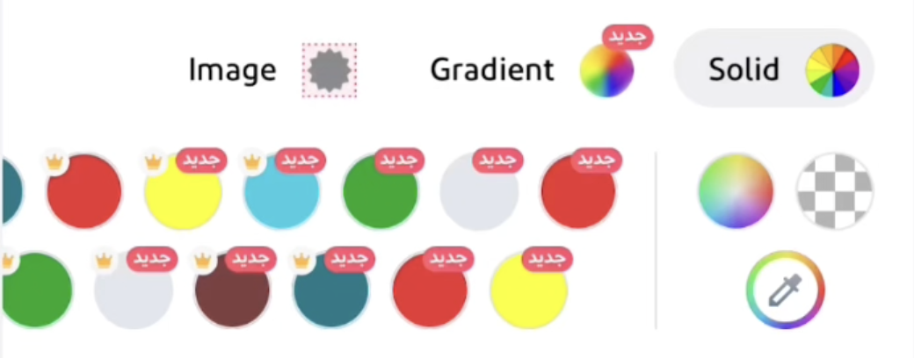

</img> 

### Task Description
You are developing a graphic design app, picking colors is essentails in such apps, but your color picker should add more value to stand out among your competitors, that's why you decided to support picking __gradients__ and __images__ as well, and to make this feature less boring you decided to update it periodically from a remote server.

The design as shown below and server response are as in the [json file here](/assets/data.json).

https://github.com/appchief/Challenge001/assets/17670201/380507b4-f805-4101-b19d-187d69f3a178

## Notes:

#### Fetching Data
- Don't write network layer, just load the json from disk
- Write proper decoding models

#### Layout
- We have two horizontal scrollable parts (Palettes & Palette Items)
- Palette items have special part in the begining, where user can pick advanced color, transparent color or use the eye-drop tool to pick any color on screen.
- Pallet items section has dynamic number of rows (can have up to three rows).

#### Interactions
Please make sure to implement the following interactions (as shown in the attached video)
- Tapping a Palette title should scroll items to that Palette
- Scrolling Items should change Palette selection and move it to screen if it's outside screen
- Tapping item should show selection indicator with animation
